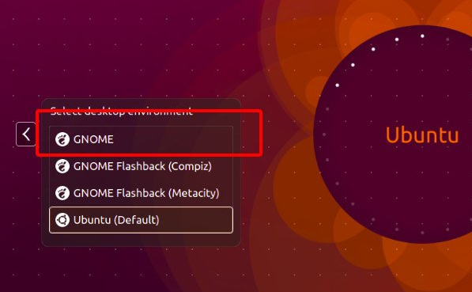
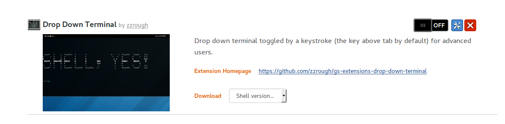
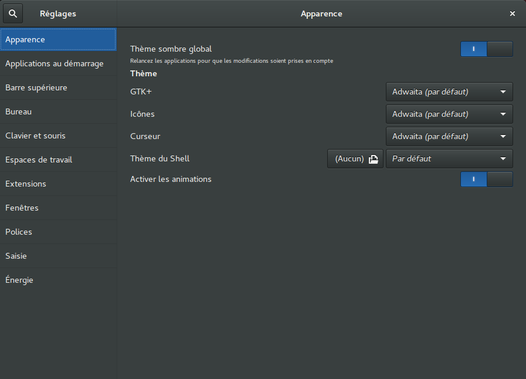

# Veille Custom Ubuntu
---

Ubuntu est personnalisable de plusieurs manières et avec plusieurs *extensions*.

Le tout se passe via [*GNOME 3*](https://www.gnome.org/gnome-3/).

Tout d'abord taper les commandes suivantes: 

- **sudo apt-get update**
&
- **sudo apt-get upgrade**

Ensuite pour l'installer, rien de plus simple, il suffit d'ouvrir le terminal et de taper les commandes suivantes: 

- 
- 

Ainsi que 

- **sudo apt install gnome-shell-extensions**
&
- **sudo apt install gnome-tweak-tool**

(Pour désinstaller [*GNOME 3*](https://www.gnome.org/gnome-3/) il suffit de répéter les deux commandes plus haut suivi d'un **remove** après **install**).

Une fois les commandes tapées et le téléchargement des *packages* terminé il faudra faire un choix entre **gdm** & **lightdm** (qui sont réspectivement la version *normale* et *light* de [*GNOME 3*](https://www.gnome.org/gnome-3/) je n'ai personnellement pas vu de grosse différence entre les deux).
Il est toujours possible de repasser de l'un a l'autre via la commande suivante: 

Ensuite :

- Fermer la session ou redémarrer la machine. (Le mieux étant de redémarrer la machine).

- Selectionner le bon *desktop* qui deviendra automatiquement celui par défaut par la suite.

---

Maintenant que le *desktop* est installé, passons aux [*extensions*](https://extensions.gnome.org/)

Encore une fois, rien de plus simple! 
Selectionnez l'extension que vous souhaitez. 
(dans cet exemple je vais choisir mon préféré)

Cliquez sur le bouton **OFF**

Une fenêtre va apparaître demandant si vous souhaitez installer l'extension. Une fois fait il vous suffit d'appuyer sur la touche **exposant** de vôtre clavier et **MAGIE!**

Il est possible de personnaliser autre chose que les extensions via **Tweak Tool** 
.

Vous pouvez également ajouter l'extension [Extension Panel](https://extensions.gnome.org/extension/1036/extensions/) qui permet de gérer vos extensions en cliquant sur le bouton  en haut a droite de vôtre ecran, pour avtiver/désactiver les extensions ou les personnaliser.

Veille **Custom Ubuntu** par [Andrea Pinna Picone](https://github.com/Andreapinnapicone)